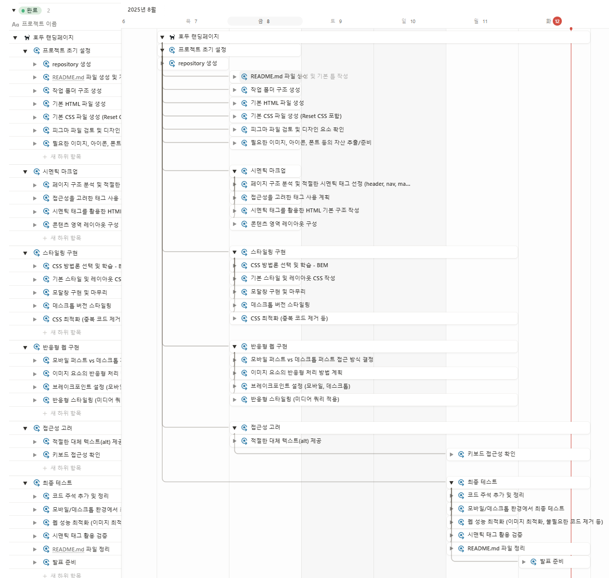
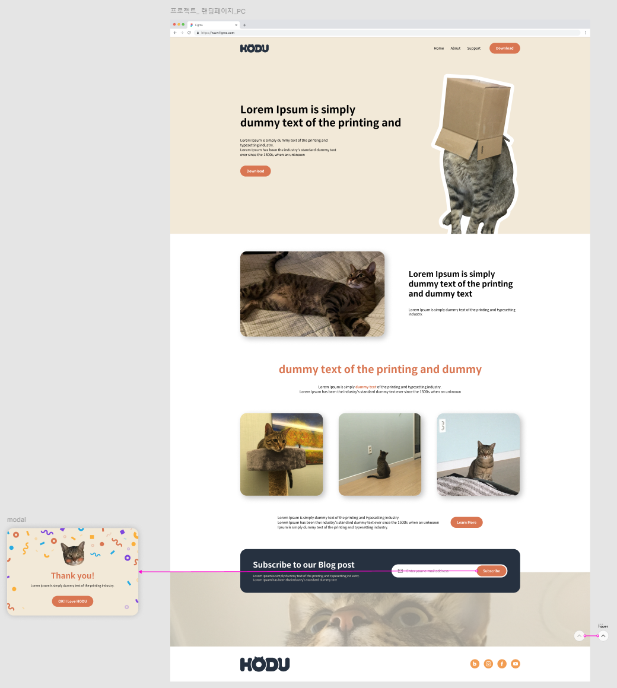
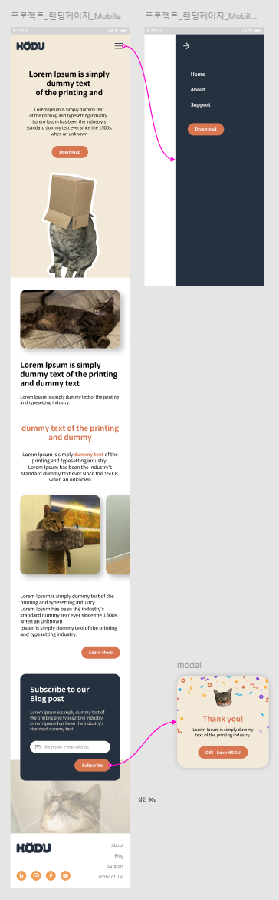

# HODU-landing

고양이 호두 랜딩페이지.
귀여운 고양이 호두를 알아보는 랜딩페이지.

## 1. 목표와 기능

### 1.1 목표

- 기간 안에 페이지 완성하기
- HTML, CSS 만을 이용한 호두 랜딩페이지 만들기
- 시멘틱 마크업, 접근성, SEO, CSS 네이밍 방법론 고려하기
- 여러가지 화면에서도 문제 없는 반응형으로 작업하기

### 1.2 기능

특수한 기능은 없으나 고려해야 할 부분을 정리

1. HTML
   - 시맨틱 마크업 준수
   - 접근성 고려
   - SEO 고려
2. CSS
   - 반응형 제작
   - CSS 네이밍 방법론 고려

### 1.3 팀 구성

개인 프로젝트로 1인 개발.

## 2. 개발 환경 및 배포 URL

### 2.1 개발 환경

- VSCode

### 2.2 배포 URL

- https://jieunheo.github.io/HODU-landing/

## 3. 요구사항 명세와 기능 명세

1. 피그마를 참고하여 페이지 구현을 합니다.
2. 시멘틱 마크업, 반응형 웹, 접근성, SEO, CSS 네이밍 방법론 등을 고려해서 작업해주세요.
3. 모바일 화면도 고려하여 페이지 구현을 합니다.
4. 스크롤시 헤더가 고정되게 합니다.
5. 구독하기 모달창의 경우 퍼블리싱 해주신 후 화면에서 보이지 않게 숨김처리 해주시고 발표할 때 노출로 전환해서 보여주세요.
6. 자바스크립트로 추후 구현할 리스트
   1. 스크롤 탑 버튼
      1. 스크롤 탑 버튼은 스크롤시 나타납니다.
      2. 스크롤 탑 버튼은 푸터 아래로 내려가지 않습니다.
      3. 스크롤 탑 버튼을 누르면 스크롤이 최상단으로 올라갑니다. (단, 부드럽게 올라가야 합니다.)
   2. 구독하기 모달창
      1. 이메일을 입력하고 `Subscribe` 버튼을 클릭하면 모달창이 나타납니다.
      2. 이메일 유효성 검사를 진행해야 합니다. (값이 들어가지 않거나 이메일 형식이 유효하지 않으면 alert 창으로 경고 문구가 떠야합니다.)
      3. 이메일이 잘 입력되었다면 모달창이 뜹니다. 이때 모달창의 `OK! I love HODU` 버튼을 클릭하면 form이 제출되고 모달창이 닫힙니다.

[피그마 참고](https://www.figma.com/design/rbi8px4O2GrnXN4gK0ZaLv/WENIV_FE_%EC%8B%A4%EC%8A%B5-%EC%98%88%EC%A0%9C?node-id=49-1791&p=f&t=2VCDDzw7QxWKjnpz-0)

## 4. 프로젝트 구조와 개발 일정

### 4.1 프로젝트 구조

```
HODU-landing
├─ images
│  ├─ arrow-left.svg
│  ├─ arrow-right.svg
│  ├─ blog.svg
│  ├─ box-cat.png
│  ├─ cat-subscribe.png
│  ├─ facebook.svg
│  ├─ footer-bg.png
│  ├─ footer-bg@2x.png
│  ├─ img1.png
│  ├─ img1@2x.png
│  ├─ img2.png
│  ├─ img2@2x.png
│  ├─ img3.png
│  ├─ img3@2x.png
│  ├─ instagram.svg
│  ├─ intro.png
│  ├─ intro@2x.png
│  ├─ logo.png
│  ├─ logo.svg
│  ├─ mail.svg
│  ├─ menu.svg
│  ├─ modal-bg-img.png
│  ├─ readme
│  │  ├─ desktop.png
│  │  ├─ mobile.png
│  │  └─ schedule.png
│  ├─ top-btn-hover.svg
│  ├─ top-btn.svg
│  └─ youtube.svg
├─ index.html
├─ README.md
└─ styles
   ├─ fonts.css
   ├─ reset.css
   ├─ style-desktop.css
   └─ style.css
```

### 4.2 개발 일정

25.08.08(금) ~ 25.08.12(화), 평일 기준 총 3일
(래포지토리 생성 및 index.html 파일 생성은 7일에 진행)



## 5. 화면

### 5.1 pc 화면



### 5.2 mobile 화면



## 6. 메인 기능

- 시멘틱 태그 사용 (header, main, footer, h1, h2, ...)
- flex 사용
- input 태그에 텍스트 필수 입력 체크 (required)
- 팝업 (JavaScript 없이 팝업 위치만 스타일링)
- CSS 방법론 - BEM 방식으로 진행
- 헤더 상단 고정, to top 버튼 우측 하단 고정
- 가상요소와 backgroung-image 사용
- 반응형 웹 테스트 (pc/mobile 2단계)
  - 모바일 퍼스트 형식으로 진행
  - pc 화면에서 배경색 확장
  - 모바일 메뉴 햄버거 형식
  - 모바일에서만 footer nav 출력

## 7. 에러와 에러 해결

### 7.1 햄버거메뉴

시안에서 상단 헤더에 있는 메뉴가 모바일일 때는 햄버거 메뉴가 되어, 버튼 클릭 시 슬라이딩 해서 나오는 형식인 것을 확인했다.
꼭 슬라이딩이 아니어도 되겠지만, 욕심을 부려서 슬라이딩을 넣기로 했다.
position을 사용해서 fixed로 위치를 고정하고 right 값을 -100%로 하여 오른쪽으로 숨겨둔 후, 햄버거메뉴 클릭 시 right 값을 0으로 만드는 형식으로 작업했다.
transition을 1초로 설정하니 슬라이드 하는 느낌으로 잘 나오는 것을 확인했다.

외관상으로는 문제 없이 작동을 했지만 Tab 버튼으로 접근할 때 문제가 있었다.
감춰져있을 때도 햄버거메뉴의 값에 접근이 가능했고, 햄버거메뉴를 띄웠을 때도 전체 화면에 접근이 가능했다.
햄버거 메뉴가 감춰져 있을 때 display none 처리를 하면 Tab으로 접근이 안되긴 했지만 슬라이드 되는 효과가 사라졌다.
다른 방법을 알아봐야 할 거 같다.
display 대신에 visibility hidden으로 감춰두니 Tab으로 접근이 안되는 것을 확인했다. 슬라이드 또한 정상작동했다.
다만 햄버거메뉴를 열고 내부에서 Tab으로 탐색 시 전페 화면 접근이 되는 것은 여전하다.

chatGPT의 도움을 받아 스크립트를 작성했다.
기능 이름은 '포커스 트랩'으로, 햅버거메뉴 내부에 있는 클릭 가능한 요소들만 순환하도록 하는 기능이었다.
ARIA 속성을 함께 사용해서 스크린리더에도 인식이 될 수 있도록 적용했다.
원하는 방식대로 정상 동작 하는 것을 확인했다.

aria 속성 중 role="dialog" aria-modal="true"를 사용하면 ARIA 속성으로 이 창이 모달임을 알려준다.
근데 이게 nav 태그에서는 사용할 수 없는 태그였다. W3C validation으로 검사해보니 빨간 줄 투성이다.
그래서 nav 태그를 감싸는 div 태그를 만들어 해당 속성을 적용했다.
이렇게 하고 보니 나는 desktop과 mobile을 동시에 지원하는 반응형 페이지를 작업하는 중인데, desktop 모드에서도 해당 속성이 작성되있는게 맞는 것인가를 고민하게 되었다.
위 고민을 끝으로, 당장은 속성을 제외 시키고 나중에 JavaScript를 이용해서 반응형으로 만드는 것이 알맞겠다는 생각을 하게 되었다.

mobile의 햄버거메뉴를 활성화 시켰을 때 왼쪽 여백을 통해서 보이는 요소가 클릭이 가능한 것을 확인했다.
이 부분은 JavaScript를 이용해서 요소 클릭을 할 수 없게, 스크롤이 되지 않게 설정한다고 했다.
스크롤은 일단 두고 요소 선택이 되지 않도록 설정하기 위해서 dimmed(딤드)를 작성해보기로 했다.
해당 부분을 적용하기 위해 HTML 태그도 조금 수정이 들어갔다.
어둑한 배경이 화면 전체적으로 들어가면서 배경 요소가 선택되지 않는 것을 확인했다.
[참고 링크](https://blog.naver.com/PostView.nhn?blogId=gounsori90&logNo=220515444685)

### 7.2 상단 박스 쓴 고양이 배치

상단부분에 고양이가 박스를 쓰고있는 사진이 있다.
이 사진을 어떤 태그로 어떻게 배치를 해야 할 지 고민을 많이 했다.
처음에는 img 태그를 이용해서 배치를 하려고 두었는데, 이 영역에서 이 고양이 사진이 의미가 있는 사진인가를 고민했다.
설명이 필요한 이미지는 아닌 것으로 판단이 되어 after 가상요소를 사용하여 배경이미지로 넣기로 했다.

배경 이미지로 넣으면서 고양이 하단 발이 잘리도록 위치시켜야 하는데, 이게 또 난감했다.
스타일 값에 이런 저런 값을 넣어보면서 확인하다보니 background의 y 위치 값을 양수로 두면 이미지가 하단으로 내려가고, 그만큼 생긴 상단 공간은 margin top 값을 음수로 주어 줄일 수 있다는 것을 알았다.
해당하는 속성 값을 조절해서 시안과 유사하게 넣을 수 있었다.

### 7.3 반응형 작업

전체적으로 반응형 작업을 하면서, 유동적인 화면을 만들기 위해 시간을 많이 사용했다.
이 문제를 해결하고자 할 때 브레이크 포인트를 잘 잡는 것이 중요하다는 것을 느꼈다.
중간단계의 화면 상태를 작업하다보니 값 하나하나를 다시 조정해야 했다.
이래서 고정값이 아닌 상대값으로 설정을 하는 것이구나 싶었다.

다양한 레이아웃을 가진 요소들을 하나의 브레이크 포인트만을 가지고 스타일 조절을 하려고 하니 어려웠다.
어떤 요소는 이정도 width 값까지는 괜찮은데 다른 요소는 너무 작거나 큰 경우가 발생했다.
화면이 겨우 두개여도 브레이크 값을 다양하게 잡아서 자연스럽게 화면을 그려주는 것이 중요하지 않을까 생각했다.
이 역시 실무에서는 디자이너와 소통해가면서 작업해야 하는 부분이라고 느꼈다.

### 7.4 가로 스크롤

작업을 하다보니 가로로 스크롤이 생기고 있던걸 발견했다.
상단 헤더의 배경이 뷰포트 가로 사이즈보다 커서 넘치는 중이었고, 고양이 사진 세개가 나열된 영역도 마찬가지였다
box-sizing border-box를 작성해두었는데도 문제가 생가는 것을 보고 무엇이 문제일까 했는데 아직 잘 모르겠다.
두 영역의 공통점은 width: 100vw 사용이었고 이 영역을 삭제하니 가로 스크롤이 사라졌다.

모바일 버전에서는 고양이 사진 세개가 나열된 부분에서 가로로 넘침이 생겨 가로 스크롤이 만들어졌다.
아마 슬라이드로 고양이 사진을 볼 수 있는 영역이 될 거 같아서 넘치는 부분을 일단 부모에게 overflow-x의 값을 scroll로 주어 이미지 영역에 가로 스크롤을 만들어주었다.

### 7.5 구독 폼과 모달

햄버거 메뉴에 사용하는 포커스 트랩을 구독 폼에 연결된 모달에도 동일하게 적용하기로 했다.
처음에는 모달에 따로 함수를 만들어서 적용했다. 그러고나서 보니 햄버거 메뉴에서 사용하는 함수와 거의 동일한 함수였다.
파라미터를 받고 햄버거 메뉴인지 모달인지를 구분하여 각 알맞는 class 명을 넣어 하나의 함수로 두 부분이 잘 동작 되도록 수정하였다.

구독 폼에는 이메일을 작성하는 input이 있다. 이왕 JavaScript를 작성한 김에 이것도 손을 봐야겠다는 생각이 들었다.
흐름을 생각해보면 구독 버튼을 누르는 순간에 이메일이 잘 작성되어있는지를 판단하고 잘 작성 되어있다면 모달을 보여주는 것이 맞다는 생각이 들었다.
또한 한 번 구독을 한 후라면 다시 버튼이 눌리지 않도록 해야 한다.
브라우저에는 기본적으로 form을 전송할 때 안에 있는 input의 유효성 검사를 실행한다.
이 기능을 활용하기 위해 button의 type을 submit으로 수정하였다.
그리고 모달을 띄우는 이벤트를 button이 아닌 form의 submit에 연결을 하여 유효성 검사를 진행할 수 있도록 했다.
만약 유효성 검사를 통과한다면 submit의 기본 동작을 멈추고 내가 작성한 모달을 띄우는 코드를 실행하도록 작성했다.
이후 모달을 종료하는 버튼을 누른다면 기존의 구독 버튼에 disabled 속성을 추가하여 비활성화를 시켜준 후 CSS에서 버튼의 색을 회색으로 바꿔주는 코드를 추가하였다.

### 7.5 :focus 와 :focus-visible

클릭이 가능한 요소에 키보드로 접근 할 때 스타일을 주고싶어서 :focus를 사용했다.
그런데 키보드 뿐 아니라 마우스로 접근시에도 스타일이 적용되는 것을 확인했다.

나는 focus관련 스타일은 다 :focus 에 작성하면 되는 줄 알았는데, 알고보니 focus 관련 가상요소가 한가지가 아니었다.
:focus는 요소에 포커스가 되었을 때 스타일로, 마우스로든 키보드로든 focus만 되면 스타일이 적용되는 가상요소다.
:focus-visible은 포커스가 필요할 때의 스타일로, 마우스가 아닌 키보드로 접근했을 때 표시할 스타일이 적용되는 가상요소다.
클릭을 할 수 없는 키보드 사용자에게 특별히 보여주고 싶은 focus 스타일이 있다면 :focus 가 아닌 :focus-visible 에 스타일을 주어야 한다.
:focus 스타일을 :focus-visible로 옮겨서 작성하니 내가 원하는 방식으로 동작하는 것을 확인했다.

## 8. 개발하며 느낀점

그냥 모양만 똑같이 작업하는 것과 웹 접근성과 SEO를 고려해서 작업하는 것이 큰 차이가 있다고 느꼈다.
tab 접근을 작업하는 중에는 모바일과 피씨의 차이를 고민해야 했고 이미지를 넣을 때는 이 이미지가 이 화면 내에 꼭 필요한 이미지인지를 고민해야 했다.
예전이었으면 아무 생각 없이 편리한 방법으로 넣었을 코드들을 왜 이렇게 넣어야 하는지 고민하면서 작업하게 되었다.

이번 프로젝트에서는 CSS 방법론을 OOCSS으로 작업해보고싶었는데, 학습 시간 부터가 시간이 너무 소요되는 거 같았다.
당장 BEM도 혼란스러운 상황이라 지금 OOCSS로 넘어가면 이것이든 저것이든 제대로 사용할 수 없을 거 같아서 다시 공부한다는 생각으로 BEM 방법론을 사용했다.
조금 시간이 여유가 생긴다면 다른 방법론들도 차근차근 알아봐야겠다.

github에 의미있는 단위로 작업물을 올리는 것도 생각보다 어려웠다. 어느정도 작업에서 끊어야 하는지도 헷갈렸다.
어떨때는 너무 많은 코드를 커밋하고 어떨때는 겨우 한두개 수정한 걸로 커밋을 한다.
여럿이서 프로젝트를 진행할 때는 커밋 메세지도 어느정도 규약을 두고 사용한다고 한다.
일반적인 커밋 규약이나 깃모지 사용방법같은 것도 한 번 알아봐야겠다.

HTML과 CSS만으로도 충분히 예쁘고 괜찮은 사이트를 만들 수 있지만 역시 번거로운 작업을 하기 위해서는 JacaScript가 필요하다는 것을 크게 느꼈다.
원하는 기능을 JavaScript 없이 구현 할 수 있는지를 열심히 검색해봤지만 반 이상이 불가능한 경우였던 거 같다.
아는 만큼 똑똑해지는 사이트를 만들 수 있다는 생각에 공부를 더 열심히 해야겠다는 생각이 들었다.

그나마 몇번 코드를 작성하다보니 자주 쓰게되는 고정 코드가 있다.
이런 것들은 프리픽스를 이용해서 쉽게 작성하도록 미리 등록해두는 것도 좋은 거 같았다.

작업을 하다가 분명 완료된 거 같아서 넘어가면 나중에 다시 볼 때 문제가 있기도 했다.
꺼진 불도 다시 보자는 말이 생각났다. 지나간 코드도 다시 보자...
